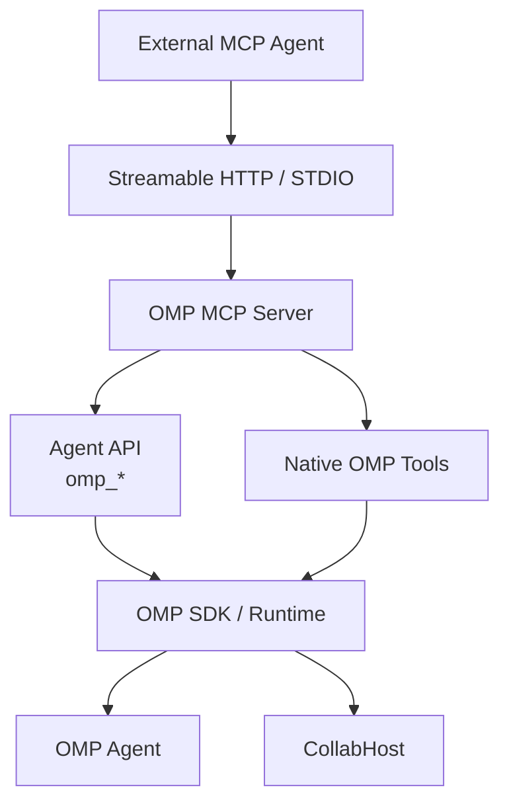

# OMP MCP Server

Standalone MCP server that exposes [Oh My Pi (OMP)](https://github.com/oh-my-pi/oh-my-pi) as a backend for external MCP clients and agents.

It provides two capabilities:

- an `omp_*` agent/session API for running and controlling OMP sessions;
- OMP's native tools directly through the MCP server.

The server supports both **Streamable HTTP** and **STDIO** transports. The default configuration is Streamable HTTP, which is suitable for running the server as a long-lived systemd service. For browser automation through OMP's Browser Relay, the deployment can also run the Relay as a separate systemd service.

## Status

The dashboard frontend is maintained separately in the standalone omp-control project. This repository retains the /api/* runtime endpoints consumed by that UI and no longer builds or serves the bundled frontend.

MVP implementation. The server uses OMP's native SDK/runtime for agent sessions and native tools, with optional Collab integration for session collaboration links.

## Requirements

- Bun 1.4+
- OMP 18.4.10+ (or a compatible version exposing the required SDK/runtime APIs)
- An OMP-authenticated model environment
- Linux for the recommended systemd deployment

## Install

### Development

```bash
bun install
```

Run locally:

```bash
bun run start
```

For development with file watching:

```bash
bun run dev
```

### Production with systemd

The repository includes a Makefile-based deployment for Linux:

```bash
sudo make setup
sudo make start
sudo make status
```

`make setup` installs the application to `/opt/omp-mcp`, creates the persistent data directory at `/var/lib/omp-mcp`, installs the OMP MCP and Browser Relay systemd units, and enables both services at boot. The services run as the existing `pstar7` user and use the Bun installation at `/home/pstar7/.bun/bin/bun`.

The deployment includes two services:

- `omp-mcp.service` — the MCP server, listening on the configured Streamable HTTP endpoint.
- `omp-mcp-browser-relay.service` — OMP Browser Relay on `127.0.0.1:9224`, allowing OMP's browser tools to drive connected Chrome/Brave tabs through the Browser Relay extension.

The Browser Relay service is intended to keep the local relay available for the browser extension. Install/connect the OMP Browser Relay extension once, then the service will restart automatically if the relay process exits.

Check both services with:

```bash
sudo make status
```

Follow both services' logs with:

```bash
sudo make logs
```

The default deployment configuration uses Streamable HTTP:

```text
http://127.0.0.1:3000/mcp
```

To inspect logs:

```bash
make logs
```

To update an existing installation from the current checkout:

```bash
sudo make update
```

To deploy an exact released version, use its Git tag:

```bash
sudo make update VERSION=v0.1.0
```

When `VERSION` is provided, the update fetches the tag from the repository and installs exactly that release. Without `VERSION`, it installs the current working tree.

To remove the application while preserving service data/workspaces:

```bash
sudo make uninstall
```

To remove the application, service data/workspaces, service user, and service group:

```bash
sudo make purge
```

Both removal commands are idempotent and verify that their managed resources were removed.

## Configuration

Configuration is loaded from environment variables. Bun automatically loads `.env` files.

Example:

```env
# Runtime
NODE_ENV=production
LOG_LEVEL=info

# MCP transport
# stdio | http | both
MCP_TRANSPORT=http
MCP_HTTP_HOST=127.0.0.1
MCP_HTTP_PORT=3000
MCP_HTTP_PATH=/mcp

# OMP
OMP_DEFAULT_MODEL=onedoor/combo-deepseek-v4-flash
OMP_DEFAULT_CWD=/var/lib/omp-mcp/workspace
```

### Transport modes

- `http` — Streamable HTTP only; recommended for systemd/server deployments.
- `stdio` — MCP over stdin/stdout; useful when another process launches `omp-mcp` directly.
- `both` — runs both transports in the same process.

`OMP_DEFAULT_CWD` is the default working directory used when an `omp_*` tool does not receive an explicit `cwd`. It is a convenience default, not a filesystem sandbox; callers can provide another working directory when needed.

## Tools

The server exposes two layers:

### Browser automation

OMP's `eval` tool can use the global `browser` API. Browser Relay can adopt and control an existing Chrome/Brave tab when the OMP Browser Relay extension is connected.

For a connected existing browser tab, use:

```js
const tab = await browser.open({
  name: "current",
  app: { relay: true },
});

return {
  url: await tab.url(),
  title: await tab.title(),
};
```

`browser.tabs()` lists OMP-managed browser handles, not necessarily every physical tab currently open in Chrome/Brave. Relay is local and uses the user's real browser session, including its logged-in state.

### Agent API (`omp_*`)

- `omp_run`: starts an OMP agent session using the native OMP SDK/runtime.
- `omp_status`: returns session status and Collab metadata.
- `omp_result`: returns the latest assistant result tracked by the MCP session manager.
- `omp_resume`: sends another instruction to a running OMP session.
- `omp_interrupt`: interrupts a running OMP agent session.
- `omp_list`: lists all sessions known to this MCP server, including completed sessions.
- `omp_collab`: retrieves a session's Collab URL or lists currently active Collab hosts.

Future agent-protocol operations such as prompt/steer/follow-up can use the same `omp_*` namespace.

### Native OMP tools

The MCP server also exposes OMP's built-in tools under their original names, without an `omp_` prefix. They execute directly through OMP's native SDK/tool registry and do not require an OMP agent session.

Typical tools include:

- `read`
- `write`
- `edit`
- `bash`
- `grep`
- `glob`
- `lsp`
- `ast_edit`
- `debug`
- `eval`
- `task`
- `wait`
- `todo`
- `web_search`

The exact native set follows the installed OMP version and its effective settings. Disabled OMP tools are not registered by the MCP server.

### Example `omp_run`

```json
{
  "task": "Fix the authentication bug",
  "cwd": "/home/user/project"
}
```

The response contains the managed session metadata and status.

## Streamable HTTP

The recommended server deployment uses MCP Streamable HTTP:

```text
http://127.0.0.1:3000/mcp
```

The endpoint is configured with `MCP_HTTP_HOST`, `MCP_HTTP_PORT`, and `MCP_HTTP_PATH`.

The server manages MCP HTTP sessions independently while sharing the underlying OMP runtime in the process.

## Collab

OMP sessions can optionally start a native `CollabHost` and expose browser collaboration links through `omp_collab`.

The `omp_collab` tool returns the active browser collaboration links for a session.

Collab availability depends on the OMP installation being authenticated and able to reach its configured relay.

Collab URLs should be treated as sensitive access links and should not be written to logs.

## Development

```bash
bun run typecheck
bun test
```

### Releases

Releases use Semantic Versioning and Git tags. The `release` target validates the source, updates `package.json`, creates an annotated `vX.Y.Z` tag, and pushes the commit and tag to the remote.

```bash
make release VERSION=0.2.0
```

Use PATCH for backward-compatible fixes, MINOR for backward-compatible features, and MAJOR for breaking changes. Release from a clean `main` branch.

## Architecture



## Current limitations

- MCP session metadata and OMP agent session metadata are stored in memory and are lost when the MCP server exits.
- The recommended HTTP deployment currently binds to `127.0.0.1`; expose it through a reverse proxy or other network boundary if remote clients are required.
- HTTP authentication is not built into this MVP. Add authentication at the reverse-proxy/network layer before exposing the endpoint beyond a trusted local environment.
- Collab availability depends on the OMP installation being authenticated and able to reach its configured relay.
